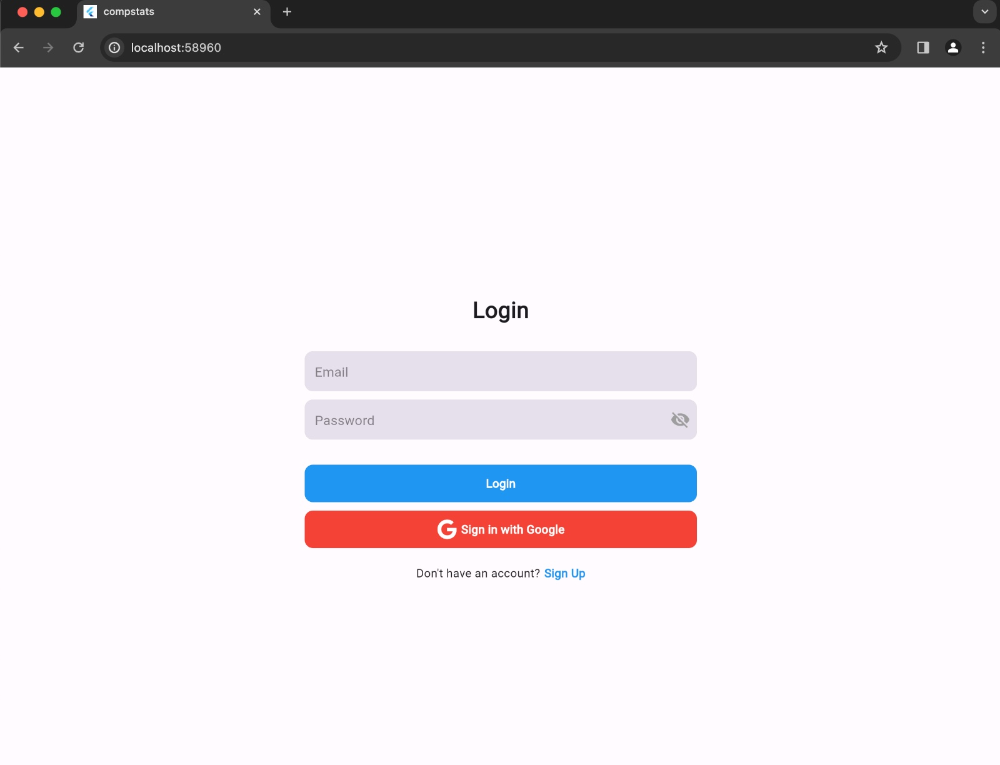

# COMPSTATS

Welcome to Compstats, the app which helps you to better analyse performance of the police and allocate resources more efficiently

## Getting Started
## Flutter application set up
To where you copy the code, write 
```bash
cd ksp_datathon
```
This will move you into the working directory
To set up flutter,
```bash
flutter pub get
```

## Server set up
First inside ksp_datathon, move into the server folder to start our servers

### api_server.py
To start api_server.py,
```bash
uvicorn api_server:app --reload
```
### Node server
First we need to install certain node modules 
For this write this command
```bash
npm install
```

To start the node server, write
```bash
node server
```
# APPLICATION ARCHITECTURE


This explains a complex architecture of our application. We are using Flutter because it is a cross platform language and thus a single code can maintain and work in web and phone. For Data Visualization, We are using Power BI for getting insights about the data maintained by the Police. Lets break it into two parts for simplification - The web app and The Mobile App.

# WEB APPLICATION

The Web Application is basically designed for the police officers to see the data in a better way and understand where and how they can improve their resource Allocation. 

## LOGIN AND SIGNUP
We have created a simple login and Signup pages for all police officers and its credentials can also be used by the same police Officer for its Mobile App login.

### LOGIN SCREEN


### SIGNUP SCREEN


## POWER BI
We have used a BI data Pipeline to ingest data every 12 hours so as to keep the BI Updated with recent Data and observe the changes in duties and beats of Police by applying some new policies .
We have created many visualizations such as FIR Type of Distribution, Time of Crime Analysis, Summary Reports of each Police Station etc.


## DATA STORAGE
Currently all the data is being stored in Postgres SQL Database and using this same database, data gets ingested to BI Data sheet.

## CHATBOT
Not everyone has time to search for records or formulate queries to search in a huge database when we look for a certain answer. For this problem, we have created a chatbot which can simple tell you what you are looking for.


## TASKS ASSIGNED
In here , the senior police officers can keep track of the tasks of their Juniors and similarly update it when required. It shows a list of already created tasks Under them.


# MOBILE APPLICATION
We have designed a mobile friendly application which uses the same credentials and is also based out of flutter , so as for better code maintainability.

## PHONE SIGNUP SCREEN


## CALENDAR SCREEN
We can see our daily tasks assigned here and if no tasks assigned, it shows in the app properly.
Current Date is highlighted as Blue and the dates on the calendar are also marked if you have a task assigned.
Further clicking on it, it shows the detail of that Task.


## TASKS ASSIGNED PAGE
We can search for content here, make changes to existing tasks and assign more tasks to the officers assigned under us too. We can keep track fo the status too. This same functionality is present in the Web app too .


## PROFILE PAGE
We can look for our profile which is fetched from the FIREBASE Realtime Database

